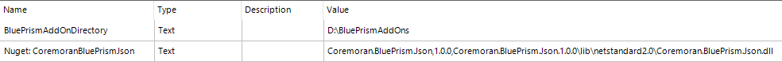
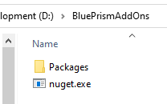

# Coremoran - Utility - Json
- [License](LICENSE)

This library helps to serialize and deserialize JSON data to or from [BluePrism](https://www.blueprism.com/) collections. This repository contains the NuGet package needed to provide the necessary functionality and a BluePrism VBO.

Furthermore this VBO shows a way to deal with NuGet packages in BluePrism. There is no need to put the NuGet assembly into the BluePrism installation directory. You can configure a local drive or a network share to load the assembly from. Even if NuGet isn't reachable e.g. due to company policies, you can install the packages from a cache directory.

Blue Prism Json depends on [Json.NET](https://github.com/JamesNK/Newtonsoft.Json) which is already part of the BluePrism installation.

## Installation

Got to the [release page](https://github.com/toarnold/Coremoran.BluePrism.Json/releases) and download the ```.bprelease``` latest file.
Install the ```.bprelease``` file on the usual way. This installs the VBO and two environment variables.

### Configuration

In BluePrism go to System -> Objects -> Environment Variables



The ```Nuget: ...``` variable is a csv (comma separated value) and has the following scheme ```<NuGet-Package-Name,Package-Version,Relativ-Assembly-Path-inside-the-package>```.
If multiple VBOs are using this package all should reference and use this environment variable to avoid assembly-version-hell.

Configure ```BluePrismAddOnDirectory``` to an existing directory. This directory will hold your expanded NuGet packages and other assemblies if needed.

Download the latest [nuget.exe](https://www.nuget.org/downloads) version and place it in this directory

Inside this directory create a folder named ```Packages```. If you are behind a corporate proxy download the needed packages and place them inside the ```Packages``` folder.

The result should look like



## API

The VBO offers the following actions

| Name | Description |
| --- | --- |
| Collection2Json | Serializes the given collection to a JSON string |
| Json2Collection | Deserializes a given JSON string to a BluePrism collection |
| Json SelectToken | Selects a JToken using a JPath expression. Selects the token that matches the object path |
| Json SelectTokens | Selects a collection of elements using a JPath expression |
| Equals | Compares the values of two tokens, including the values of all descendant tokens |

The .NET assembly exports ```Coremoran.BluePrism.Json.BluePrismConverter```. A static class with conversion functions.
There is another usefull static method ```public static DataTable ObjectToCollection(object o)```. This method serializes any JSON serializeable object to a BluePrism collection. This is helpfull if a code stage has to return dynamic result as a collection.

## Limitations and notices

* A ```single row``` collection will serialize as a JSON object and vice versa
* All other collections will result in a JSON array
* An 'anonymous' JSON array like ```[1,2,3]``` will result in a collection with a single numeric column named ```__JSON_unnamed_Value```
* The first occurence of a JSON value will define the data type of the collection column, all other occurences of this value will be tried to convert to this data type. If this isn't possilbe an exception will be thrown.
* Nested collections are supported.
* This library is intended to be used with structural identical data.
    * Be warned: Mixed JSON arrays like ```[1, {"Key":123,"Value":"TEST"},"4711"]``` will result in strange looking collections.
